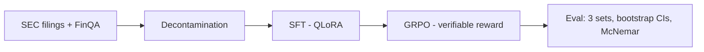

# OpenTune — Fine-Tuning & Evaluation Pipeline

> SFT (QLoRA) → GRPO (verifiable rewards) on an open-weight LLM, with statistically
> defensible improvement on a decontaminated financial QA benchmark, plus an
> un-confounded fine-tune-vs-prompting contrast experiment.

**Status:** Phase 0 — **gate evaluated, result: FAIL** (see §1/§5). Qwen3-8B
CoT baseline, frontier CoT baseline (`anthropic/claude-haiku-4.5` via
OpenRouter), and the cross-model paired comparison are all complete. The
pre-registered "frontier beats Qwen CoT by ≥8pts on FinQA test with
non-overlapping CIs" gate did not clear, though the difference is
statistically real (McNemar p<0.0001), just smaller than the pre-registered
bar. Next: decide the Phase 1 contribution framing (see §5 decision needed).

---

## 1. TL;DR Results

All numbers carry bootstrap 95% CIs (10,000 resamples, seed=0); each cell
links to the result artifact that produced it. No number appears here that
isn't linked to an artifact. Frontier row is paired to Qwen on shared ids;
n reflects the paired set exactly (all three sets paired at full n, no
dropped ids).

| Model / method | FinQA test (n=1,127) | Custom eval (n=450) | SEC 2026 eval (n=180) |
|---|---|---|---|
| Qwen3-8B (zero-shot) | 47.47% [44.54, 50.40] | 45.33% [40.88, 50.00] | 58.33% [51.11, 65.56] |
| Qwen3-8B (best-effort prompting = CoT)¹ | 65.57% [62.82, 68.32] | 62.89% [58.44, 67.33] | 73.33% [66.67, 79.44] |
| **Frontier (`anthropic/claude-haiku-4.5`, CoT)²** | **70.90% [68.23, 73.56]** | **68.89% [64.67, 73.12]** | **66.11% [59.44, 72.78]** |
| SFT (QLoRA) | — | — | — |
| GRPO (verifiable reward) | — | — | — |

¹ CoT, not few-shot, is the locked best-effort-prompting arm: it beat
zero-shot on all three sets (exact McNemar p<0.0001 custom eval, p<0.0001
FinQA test, p=0.0006 SEC 2026). Few-shot was not significantly different from
CoT on custom eval (p=0.2589) and its FinQA-test cell was never run.

² Frontier vs. Qwen CoT, paired exact McNemar (`scripts/compare_frontier.py`,
full report in `docs/gate_decision.md`):

| Eval set | Delta (pts) | CIs non-overlapping | McNemar b/c | McNemar p |
|---|---:|---|---|---:|
| finqa_test (**gate set**) | +5.32 | no | 134/74 | <0.0001 |
| custom_eval | +6.00 | no | 52/25 | 0.0028 |
| sec_2026 | −7.22 | no | 19/32 | 0.0919 |

**Gate result: FAIL.** Frontier beats Qwen CoT on FinQA test by a real,
statistically significant margin (p<0.0001) — but +5.32 points falls short of
the pre-registered ≥8-point bar, and the CIs overlap. Frontier also
underperforms Qwen CoT on SEC 2026 (not significant, n=180). Per the
pre-registered fallback, this means changing the Phase 1 contribution framing
rather than proceeding on the original "beat a frontier model on accuracy"
premise — see the Decisions Log entry below for the open framing decision.
Important caveat: the pinned frontier snapshot is Anthropic's near-frontier
tier (Claude Haiku 4.5), chosen to fit a $3–6 budget — this result
characterizes the gap to *that* model, not necessarily to a flagship-tier
frontier model, which was not tested.

Raw predictions: `results/raw/Qwen3-8B__*.jsonl`,
`results/raw/anthropic--claude-haiku-4-5__*.jsonl`. Base aggregates:
`results/aggregates.json`, `docs/baselines.md`. Cross-model gate comparison:
`docs/gate_decision.md`. Total frontier API spend: **$3.9994**. W&B project:
`opentune-phase0`.

## 2. Pipeline Diagram

<!-- Mermaid or image; update at each phase checkpoint -->



## 3. Quickstart / Reproduce

<!-- One command that recomputes the headline number; pinned deps -->

```bash
uv sync
uv run pytest -q            # 45 tests: extractor + prompt contract + exemplar consistency
# Rebuild the data core:
uv run python scripts/build_dataset.py      # FinQA parquets + gold policy
uv run python -m opentune.decontaminate     # decontaminated train + report
uv run python scripts/build_custom_eval.py  # custom eval (seed 42)
uv run python scripts/build_sec_eval.py     # SEC time-split eval (hits live EDGAR API)
# Base baselines (Kaggle T4, single-GPU pinned):
uv run python scripts/run_baselines.py --arm cot --eval-set finqa_test
uv run python scripts/aggregate_results.py  # bootstrap CIs + McNemar -> docs/baselines.md
# Frontier baseline via OpenRouter:
cp .env.example .env            # then fill in OPENROUTER_API_KEY; .env is gitignored
uv run python scripts/run_frontier.py --estimate --eval-set all   # zero-cost cost check first
uv run python scripts/run_frontier.py --eval-set all
# Cross-model gate comparison (frontier vs. Qwen CoT, paired McNemar):
uv run python scripts/compare_frontier.py   # -> docs/gate_decision.md
```

## 4. Dataset

- **Source:** FinQA canonical release (`github.com/czyssrs/FinQA` JSONs, sha256
  logged in dataset card) — license **CC-BY-4.0**
- **Core training set:** 5,828 decontaminated examples
  (6,251 raw → 124 non-numeric golds dropped → 6,127 → 299 contamination-dropped)
- **Target training size:** 6–8k after mixing synthetic SEC-filing examples
  (synthetic capped at 30–40%; synthetics pass the same decontamination gate)
- **Eval sets (all frozen):**
  1. **FinQA test** — 1,127 rows. Zero-shot, CoT, and frontier CoT are run;
     few-shot on this set has **not** been run.
  2. **Custom eval** — n=450, stratified sample of FinQA dev across
     (primary operator × context-length quartile), seed 42; composition
     matches dev within ~0.2 pts per operator band; median context 4,029 vs
     4,028 chars. Decontaminated vs train by construction (dev was in the
     decontamination corpus). All Qwen arms plus frontier CoT are run here.
  3. **SEC 2026 time-split eval** — n=180 across 37 companies, filings
     2026-01-09 to 2026-09-02. Golds **computed from XBRL company facts**
     (EDGAR API), never LLM-generated. All facts are filed after Qwen3-8B's
     release (2025-04-29), which makes this a **conservative post-release
     time-split / contamination-resistant check** — not a proof of
     corpus absence, since neither model's exact pretraining cutoff is
     officially disclosed. Frontier CoT actually scored *below* Qwen CoT
     here (66.11% vs. 73.33%, not significant at n=180) — a useful reminder
     that this set's condensed XBRL-table surface and narrow question
     templates don't necessarily favor whichever model wins on FinQA prose.
- **Gold-selection bookkeeping:** primary `exe_ans` covers 100% of kept FinQA
  rows; the `answer`-string fallback never fired on this revision

### Gold-selection policy (locked 2026-09-13, extractor v1.1)

All scoring uses `src/opentune/extract.py` (task-spec v1.1, 40-unit-test suite).

1. Primary gold: `exe_ans` (raw numeric)
2. Fallback: `answer` string if `exe_ans` fails extraction
3. Example dropped if neither field parses — applied identically to every
   model and arm

| Split | Raw | Non-numeric dropped | Kept | Exclusion rate |
|---|---|---|---|---|
| train | 6,251 | 124 | 6,127 | → decontamination below |
| dev | 883 | 10 | 873 | 1.13% |
| test | 1,147 | 20 | 1,127 | 1.74% |

### Smoke validation

Full dev split, 1,766 gold values: 97.7% parse coverage; every failure
accounted for as non-numeric/empty gold. LaTeX-escape artifacts (`4.9\n`) and
scientific-notation golds (`1e-05`) handled by extractor v1.1. Text artifacts
cleaned model-side by `build_dataset.py`; golds cleaned scorer-side only.

### Decontamination (locked 2026-09-13)

- 8-gram word-level containment; eval-side corpus = dev + test question and
  context shingles (377,298 distinct 8-grams)
- Drop rule: question-containment ≥ 0.5 vs. **any** eval-side shingle
- Result: 299 / 6,127 train examples dropped (4.9%) → 5,828 decontaminated
- Known aggressiveness: short template questions ("what is the growth rate in
  net revenue in 2008?") collide at q-containment 1.0 even across unrelated
  filings; the data loss is accepted over leakage risk (decisions log)
- Context-side containment measured, not dropped on (filing boilerplate):
  p50 = 0.043, p95 = 0.657 — disclosed for transparency
- Report: `data/processed/decontamination_report.json`
- Synthetic SEC training examples will pass the same gate before mixing

### SEC eval invariants (verified mechanically at build time)

1. Every gold self-scores through the extractor (0 unparseable)
2. Every program string **executes to its gold** (0 mismatches — catches
   sign-convention drift)
3. Every numeric figure in a program appears verbatim in its context

Percent-change convention: change relative to the **magnitude** of the base
period; programs encode |base| explicitly (see experiment log).

### Operator inventory (decontaminated train)

Core: divide 4,175 | subtract 2,540 | add 1,480 | multiply 550.
Table band: table_average 92 | table_max 48 | table_sum 34 | table_min 27.
Tail: exp 5; power/greater absent. Phase 2 format-reward grammar = this set.

## 5. Decisions Log

| Date | Decision | Choice | Rationale |
|---|---|---|---|
| 2026-09-13 | Base model (Phases 1–2) | **Qwen3-8B — verified:** Apache 2.0 (derived weights OK w/ notices), 32K native context | Strongest permissively-licensed 7–9B at kickoff |
| 2026-09-13 | Small model (Phase 3) | Qwen3-4B (same-family 3–4B) | Clean size ablation for the contrast experiment |
| 2026-09-13 | Domain / task | Financial QA (FinQA) | Ties into SEC-filings narrative |
| 2026-09-13 | FinQA source | Canonical GitHub JSONs, sha256-pinned | Hub copies ship legacy loader scripts / merge splits — unpinned, unsafe |
| 2026-09-13 | Prompting arm | Few-shot + CoT + format constraints; exemplars from **train only**, hand-verified | Half-hearted prompting is attackable; exemplar leakage silently inflates evals |
| 2026-09-13 | RL method | GRPO w/ verifiable rewards (not DPO) | FinQA has exact gold answers; verifiable-reward RL is best practice |
| 2026-09-13 | Training stack | Unsloth (QLoRA) + TRL `GRPOTrainer` | Single-GPU proven; fast SFT on free T4s |
| 2026-09-13 | Eval stack | Custom scorer, rule-based extraction (unit-tested) | Extraction bugs silently corrupt all numbers |
| 2026-09-13 | Scoring tolerance | Piecewise: 0.01 abs; 0.1% rel only for \|gold\| ≥ 1000 | Original `max()` formula let the relative arm dominate from \|gold\| ≥ 10 — caught by boundary tests pre-baseline |
| 2026-09-13 | Percent canonicalization | `x%` ≡ `x/100`; bare `37.5` vs gold `0.375` is a miss | FinQA golds mix both forms; symmetric rule, documented edge |
| 2026-09-13 | Multi-answer lines | Last non-empty ANSWER line wins | Models self-correct; first-line rule penalizes correction |
| 2026-09-13 | Statistics | Bootstrap CIs everywhere; McNemar for paired comparisons; 3 seeds for headlines | n=200 noise floor made ±8-pt gates unsupported |
| 2026-09-13 | Decontamination rule | Conservative corpus-level question containment; accept ~5% over-drop incl. benign template collisions | Simplicity + reviewer-defensibility over data recovery |
| 2026-09-13 | Time-split boundary | SEC filings filed ≥ 2026-01-01 | Post-Qwen3-release proxy; explicitly **not** a formal proof of zero contamination for either arm, since neither model's exact pretraining cutoff is disclosed |
| 2026-09-13 | SEC eval source | EDGAR XBRL companyfacts API; golds computed, not LLM-written | Exact verifiable golds, `filed` filter enforces cutoff mechanically; declared UA + ≤5 req/s pacing per SEC fair-access policy |
| 2026-09-13 | Tracking / hosting | W&B (free), HF Hub weights + model cards | Free, recruiter-visible |
| 2026-09-14 | GPU execution | Single T4 process (`CUDA_VISIBLE_DEVICES=0` set pre-import) | Unsloth's Qwen3 attention path put padded attention bias on cuda:0 while layers ran on cuda:1 under 2-GPU batching; single-GPU pin fixed it |
| 2026-09-16 | Best-effort-prompting arm | **CoT**, not few-shot | Significantly beats zero-shot on all 3 sets; not significantly different from few-shot on custom eval (p=0.2589), so no superiority claim there — CoT wins on "most sets with the most data" |
| 2026-09-16 | Frontier snapshot | `anthropic/claude-haiku-4.5` (Claude Haiku 4.5) via OpenRouter, provider pinned to `anthropic` | Near-frontier tier; flagship tiers (Opus 5 / Sonnet 5 / GPT-5.6 Terra) priced at ~$10–19 for the workload, past the $3–6 target — actual spend came in at $4.00 |
| 2026-09-16 | Frontier decode config | `temperature=0`, no `reasoning` param set | Deterministic; prompted-CoT parity with Qwen's CoT arm |
| 2026-09-16 | Secret management | `OPENROUTER_API_KEY` in a local `.env` (gitignored), loaded via `python-dotenv` | Never commit API keys |
| 2026-09-16 | **Phase 0 gate evaluated** | **FAIL** — frontier CoT beats Qwen CoT by +5.32 pts on finqa_test (McNemar p<0.0001, real but modest), short of the pre-registered ≥8-pt / non-overlapping-CI bar; frontier underperforms on SEC 2026 (not significant) | Gate criterion was pre-registered before any results existed, specifically to prevent post-hoc goal-moving; result stands as measured against `anthropic/claude-haiku-4.5` |
| **OPEN** | Phase 1 framing | **Not yet decided** — options: (a) reframe contribution around cost/latency parity with a paid API rather than raw accuracy superiority, per the original gate's own pre-registered fallback; (b) spend an incremental ~$15–20 to test one flagship-tier snapshot (e.g. Claude Sonnet 5) on finqa_test only, to see whether a true flagship clears 8pts before committing to a framing pivot; (c) proceed to SFT/GRPO anyway with a revised, smaller target delta (e.g. "close the majority of the gap to near-frontier prompting" instead of "beat frontier") | Decision intentionally left open here rather than picked silently — pick and log before starting Phase 1 |

## 6. Experiment Log

Negative results stay in. Every run: config, cost, result, verdict.

| Date | Run | Config | Cost | Result | Verdict |
|---|---|---|---|---|---|
| 2026-09-13 | Extractor v1 | task-spec v1 | $0 | `max()` tolerance formula let relative arm dominate at \|gold\| ≥ 10; caught by boundary test | Rolled back → piecewise rule |
| 2026-09-13 | Extractor v1.1 | + LaTeX-escape golds, scientific notation | $0 | 3 new format tests pass; 40-test suite green | Kept |
| 2026-09-13 | Gold smoke validation | Full FinQA dev, 1,766 golds | $0 | 97.7% per-field coverage; all failures = documented non-numeric tail | Kept; filter policy locked |
| 2026-09-13 | Dataset build v1 | FinQA canonical JSONs | $0 | Literal `\n`/`\t` artifacts leaking into model-facing text | Fixed in build v2 (clean_text); counts unchanged |
| 2026-09-13 | Decontamination run 1 | 8-gram containment @ 0.5, dev+test corpus | $0 | 299/6,127 dropped (4.9%) → 5,828; worst offenders = benign template collisions | Kept (conservative rule) |
| 2026-09-13 | Prompt templates | zero-shot / CoT / few-shot v1 | $0 | few-shot v1 committed with display-elided contexts; caught at render check; regenerated verbatim from parquet | Fixed; render verified |
| 2026-09-13 | Custom eval build | stratified (operator × ctx quartile), seed 42 | $0 | n=450; composition drift ≤0.2 pts/band; median ctx 4,029 ≈ dev 4,028 | Kept |
| 2026-09-13 | SEC eval v1 | EDGAR XBRL, 60-company sample | $0 | magnitude-base sign mismatch (program ‖ gold on negative-base rows) found by eyeball sample; first-pass validator also misparsed multi-arg ops | Both fixed; all 3 invariants verified |
| 2026-09-13 | SEC eval v2 | n=180, 37 companies, filed 2026-01-09..09-02 | $0 | 0 unparseable golds; 0 program-gold mismatches; 0 figures absent from context | Kept |
| 2026-09-14 | Base runner v1 dry run | Serial decode, `max_new_tokens=640` | $0 (compute) | Zero-shot rambled after answer → 52.6 sec/example, projected ~77 GPU-hours for full matrix | Replaced by stop-string boundaries + batching |
| 2026-09-14 | Base runner v2, T4×2 | Padded batched generation | $0 | Unsloth Qwen3 attention-mask cuda:0/cuda:1 device mismatch, crashed | Pinned to single GPU (`CUDA_VISIBLE_DEVICES=0`) |
| 2026-09-14 | Few-shot batch sizing | Single T4, batch 8 | $0 | CUDA OOM from ~3k-token exemplar overhead + KV cache | Batch size 4; kept |
| 2026-09-14–16 | Qwen3-8B baseline matrix | Greedy NF4, resumable JSONL, 3 arms × up to 3 eval sets | $0 (free-tier GPU) | All expected cells present at exact row counts except few-shot/finqa_test (deferred); see `docs/baselines.md` | Kept |
| 2026-09-16 | Aggregation | Bootstrap 95% CI (10k resamples) + exact McNemar | $0 | CoT beats zero-shot everywhere (p<0.0001 to p=0.0006); CoT vs. few-shot not significant on custom eval (p=0.2589); few-shot vs. zero-shot not significant on SEC (p=0.1052) | CoT locked as best-effort-prompting arm |
| 2026-09-16 | Frontier snapshot pricing | Priced Anthropic/OpenAI/Google current tiers against the 1,757-call CoT workload | $0 | Flagship tiers project $10–19; Claude Haiku 4.5 projects ~$5–8 | Pinned `anthropic/claude-haiku-4.5` via OpenRouter |
| 2026-09-16 | `run_frontier.py` build + fixes | Resumable, retrying, cost-logging runner; fixed to match real `render_prompt(name, question, context)` and `score(output, gold)` signatures after first pass errored | $0 | `--estimate` projected $8.28 worst case | Ready to execute |
| 2026-09-16 | Frontier CoT run — sec_2026 | n=180, max_tokens=700, temp=0 | $0.2907 | 66.11% acc; 180/180 `status=ok`, 180/180 `finish_reason=stop` | Clean run, below Qwen CoT (73.33%) on this set |
| 2026-09-16 | Frontier CoT run — custom_eval | n=450, same config | $1.0547 (cumulative $1.3454) | 68.89% acc | Clean run |
| 2026-09-16 | Frontier CoT run — finqa_test | n=1,127, same config | $2.6540 (cumulative $3.9994) | 70.90% acc | Clean run; total frontier spend $4.00, within $3–6 target |
| 2026-09-16 | Cross-model gate comparison | `scripts/compare_frontier.py`, paired bootstrap CI + exact McNemar, frontier vs. Qwen CoT, all 3 sets | $0 | finqa_test: +5.32pts, p<0.0001, CIs overlap. custom_eval: +6.00pts, p=0.0028, CIs overlap. sec_2026: −7.22pts, p=0.0919, CIs overlap | **Gate: FAIL** (pre-registered ≥8pt / non-overlap bar not met); Phase 1 framing decision now open (see §5) |

## 7. Failure Modes / Known Limitations

- Unit-burdened FinQA golds (e.g. `$ 108 million`) excluded rather than guessed —
  the intended scale is context-dependent
- ~1–2% of FinQA per split unscorable by design (yes/no tail, empty
  annotations, rare annotation garbage) — exclusion counts in §4
- Decontamination over-drops short template questions (~5% of train) — a
  deliberate trade
- FinQA itself may occur in base-model pretraining corpora — why the SEC 2026
  set exists (contamination-side check)
- SEC eval contexts are **condensed XBRL fact tables**, not raw filing prose —
  tests post-cutoff reasoning over real SEC data, not raw-document reading
- SEC eval question diversity is two shapes (QoQ percent-change, cash/asset
  portion); it is a contamination check, not a general-capability benchmark;
  it's also the one set where frontier CoT underperformed Qwen CoT, so it's
  not a simple "frontier just wins" story
- EDGAR universe sampled randomly: SPACs/ADRs yield nothing (+0); 23 of 60
  sampled companies contributed no facts
- **The SEC 2026 time split is a proxy, not proof:** neither model's exact
  pretraining cutoff is officially disclosed
- Few-shot on FinQA test has not been run; the base prompt ablation is not a
  complete 3×3 matrix yet
- Output-extraction compliance is imperfect and arm-dependent for the base
  model (zero-shot as low as 80.6% OK); frontier extraction was clean
  (180/180 `status=ok` observed on sec_2026, no truncated completions)
- **The pinned frontier snapshot (Claude Haiku 4.5) is near-frontier, not
  flagship, tier.** The measured +5.32pt / gate-FAIL result is specific to
  this model. A flagship-tier frontier model was not tested due to budget,
  so it remains genuinely unknown whether a flagship model would clear the
  8-point bar — this is the single biggest open question hanging over the
  Phase 1 framing decision (§5)
- The pre-registered gate itself is a conservative, somewhat blunt
  instrument: "non-overlapping CIs" conflates statistical significance with
  effect size. The finqa_test result is statistically significant
  (McNemar p<0.0001) but fails the gate anyway because the CI-overlap
  criterion and the 8-point threshold are both stricter than a plain
  significance test

## 8. Artifacts Index

- Extractor + scoring: `src/opentune/extract.py` (task-spec v1.1) — 40 tests
- Prompt templates + verified exemplars: `src/opentune/prompts/` — 5 contract tests
- Task spec: `docs/task-spec.md`
- Data: `data/processed/finqa_{train,dev,test}.parquet`,
  `finqa_train_decontaminated.parquet`, `decontamination_report.json`
- Eval sets: `data/eval/custom_eval.parquet` (n=450, seed 42),
  `data/eval/sec_2026_eval.parquet` + `sec_2026_report.json` (n=180)
- Base baselines: `scripts/run_baselines.py`, `scripts/aggregate_results.py`,
  `results/raw/Qwen3-8B__*.jsonl`, `results/aggregates.json`, `docs/baselines.md`
- Frontier baseline: `scripts/run_frontier.py` (OpenRouter,
  `anthropic/claude-haiku-4.5`, provider `anthropic`),
  `.env.example` (copy to `.env`, gitignored),
  `results/raw/anthropic--claude-haiku-4-5__cot__*.jsonl`,
  `results/raw/manifest_frontier__anthropic--claude-haiku-4-5.json`
- Cross-model gate comparison: `scripts/compare_frontier.py`,
  `docs/gate_decision.md`
- Weights + model cards: — (HF Hub, TBD)
- Reward function: `src/opentune/` (Phase 2)
- Demo: — (pre-recorded video, Phase 4)

## 9. License & Citation

FinQA: CC-BY-4.0 (cite FinQA paper — Chen et al., EMNLP 2021).
Qwen3-8B: Apache 2.0 (derived-weight redistribution permitted with notices).
Claude Haiku 4.5: Anthropic proprietary model, accessed via OpenRouter's API
under OpenRouter's and Anthropic's respective terms — outputs used for
evaluation only, no weights redistributed.
SEC EDGAR companyfacts: public domain government data, accessed per fair-access
policy (declared UA, ≤5 req/s).
TODO — code license, synthetic-data provenance. Finalized before Phase 4.

## 10. Changelog

| Date | Phase | Change |
|---|---|---|
| 2026-09-13 | 0 | Repo initialized. |
| 2026-09-13 | 0 | Extractor v1.1 + task-spec v1 locked (40 tests); tolerance-formula fix logged. |
| 2026-09-13 | 0 | Data core locked: FinQA parquets (gold policy), decontaminated train (5,828), contamination report published. |
| 2026-09-13 | 0 | Prompt templates + hand-verified exemplars locked (45 tests); operator inventory recorded. |
| 2026-09-13 | 0 | Custom eval frozen (n=450, stratified, seed 42). |
| 2026-09-13 | 0 | SEC 2026 time-split eval built (n=180, 37 co.): XBRL-computed golds, post-release time split (framed as a proxy, not proof), 3 mechanical invariants. Base model verified (Qwen3-8B, Apache 2.0). |
| 2026-09-16 | 0 | Qwen3-8B baseline matrix run and aggregated (bootstrap CIs + exact McNemar); CoT locked as best-effort-prompting arm. |
| 2026-09-16 | 0 | Frontier snapshot pinned (`anthropic/claude-haiku-4.5` via OpenRouter, provider pinned to `anthropic`); `scripts/run_frontier.py` implemented, `OPENROUTER_API_KEY` read from gitignored `.env`. |
| 2026-09-16 | 0 | Frontier CoT run executed on all 3 eval sets (sec_2026, custom_eval, finqa_test); total spend $3.9994. |
| 2026-09-16 | 0 | Cross-model gate comparison run (`scripts/compare_frontier.py`): **Phase 0 gate result = FAIL** — finqa_test delta +5.32pts (p<0.0001, CIs overlap), below the pre-registered ≥8pt bar. Phase 1 contribution-framing decision left open pending review. |

---

### Hardware / workflow note

Development on M2 Air 8GB (scripting, data curation, ≤1B dry-runs only). All 7–9B
training and evaluation runs on Kaggle / Colab free tier; RunPod A100 (~$1–1.50/hr)
as paid fallback. Budget target: ≤ $30 total. Budget spent to date: **$3.9994**
(frontier baseline via OpenRouter; base baselines ran on free-tier GPU at $0
API cost).
