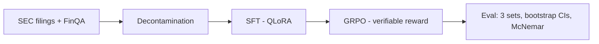

# OpenTune — Fine-Tuning & Evaluation Pipeline

> SFT (QLoRA) → GRPO (verifiable rewards) on an open-weight LLM, with statistically
> defensible improvement on a decontaminated financial QA benchmark, plus an
> un-confounded fine-tune-vs-prompting contrast experiment.

**Status:** Phase 0 — task definition, decontaminated data & baselines.

---

## 1. TL;DR Results

All numbers carry bootstrap 95% CIs; each cell links to the W&B run or results JSON
that produced it. No number appears here that isn't linked to an artifact.

| Model / method | FinQA test (acc) | Custom eval, n≈400–500 (acc) | Time-split SEC eval (acc) |
|---|---|---|---|
| Base model (zero-shot) | — | — | — |
| Base model (best-effort prompting) | — | — | — |
| Frontier snapshot (prompted) | — | — | — |
| SFT (QLoRA) | — | — | — |
| GRPO (verifiable reward) | — | — | — |

## 2. Pipeline Diagram

<!-- Mermaid or image; update at each phase checkpoint -->



## 3. Quickstart / Reproduce

<!-- One command that recomputes the headline number; pinned deps -->

```bash
uv sync
# TODO: reproduce command once eval harness lands
```

## 4. Dataset

- **Core:** FinQA train (~6k)
- **Target training size:** 6–8k after mixing synthetic SEC-filing examples (synthetic capped at 30–40%)
- **Eval sets:** (1) FinQA test, (2) custom decontaminated eval n≈400–500, (3) time-split SEC eval — filings dated after the base model's training cutoff
- **Decontamination:** n-gram overlap of all training data vs. eval sets — method + results: TODO
- **Licenses:** TODO (dataset card)

## 5. Decisions Log

| Date | Decision | Choice | Rationale |
|---|---|---|---|
| 2026-09-13 | Base model (Phases 1–2) | Qwen3-8B (verify at kickoff) | Strongest permissively-licensed 7–9B; verify license permits derived weights |
| 2026-09-13 | Small model (Phase 3) | Qwen3-4B (same-family 3–4B) | Clean size ablation for the contrast experiment |
| 2026-09-13 | Domain / task | Financial QA (FinQA) | Ties into SEC-filings narrative |
| 2026-09-13 | Frontier baseline | Flagship API model, dated snapshot pinned (`model-name-YYYY-MM-DD`) | Baselines must not shift mid-project |
| 2026-09-13 | Prompting arm | Few-shot + CoT + format constraints | Half-hearted prompting makes the contrast experiment attackable |
| 2026-09-13 | RL method | GRPO w/ verifiable rewards (not DPO) | FinQA has exact gold answers; verifiable-reward RL is best practice |
| 2026-09-13 | Training stack | Unsloth (QLoRA) + TRL `GRPOTrainer` | Single-GPU proven; fast SFT on free T4s |
| 2026-09-13 | Eval stack | lm-eval + custom scorer, rule-based extraction (unit-tested) | Extraction bugs silently corrupt all numbers |
| 2026-09-13 | Statistics | Bootstrap CIs everywhere; McNemar for paired comparisons; 3 seeds for headlines | n=200 noise floor made ±8-pt gates unsupported |
| 2026-09-13 | Tracking / hosting | W&B (free), HF Hub weights + model cards | Free, recruiter-visible |

## 6. Experiment Log

Negative results stay in. Every run: config, cost, result, verdict.

| Date | Run | Config | Cost | Result | Verdict |
|---|---|---|---|---|---|
| — | — | — | — | — | — |

## 7. Failure Modes / Known Limitations

- TODO — updated whenever a gate fails or a weakness is found.

## 8. Artifacts Index

- Weights + model cards: — (HF Hub, TBD)
- Eval sets: — (HF dataset repo, TBD)
- Reward function: `src/opentune/` (Phase 2)
- Demo: — (pre-recorded video, Phase 4)

## 9. License & Citation

TODO — code license, base-model license compliance for derived weights, FinQA usage
terms, synthetic-data provenance. Finalized before Phase 4 weight publication.

## 10. Changelog

| Date | Phase | Change |
|---|---|---|
| 2026-09-13 | 0 | Repo initialized. |

---

### Hardware / workflow note

Development on M2 Air 8GB (scripting, data curation, ≤1B dry-runs only). All 7–9B
training and evaluation runs on Kaggle / Colab free tier; RunPod A100 (~$1–1.50/hr)
as paid fallback. Budget target: ≤ $30 total.
