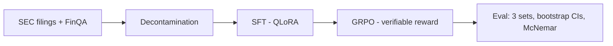

# OpenTune — Fine-Tuning & Evaluation Pipeline

> SFT (QLoRA) → GRPO (verifiable rewards) on an open-weight LLM, with statistically
> defensible improvement on a decontaminated financial QA benchmark, plus an
> un-confounded fine-tune-vs-prompting contrast experiment.

**Status:** Phase 0 — all data + eval artifacts locked (extractor, gold policy,
decontaminated train, 3 frozen eval sets, prompt templates verified). Next:
frontier snapshot pin, eval-runner notebook, baseline runs, go/no-go gate.

---

## 1. TL;DR Results

All numbers carry bootstrap 95% CIs; each cell links to the W&B run or results JSON
that produced it. No number appears here that isn't linked to an artifact.

| Model / method | FinQA test (n=1,127) | Custom eval (n=450) | SEC 2026 eval (n=180) |
|---|---|---|---|
| Qwen3-8B (zero-shot) | — | — | — |
| Qwen3-8B (best-effort prompting) | — | — | — |
| Frontier snapshot (prompted) | — | — | — |
| SFT (QLoRA) | — | — | — |
| GRPO (verifiable reward) | — | — | — |

## 2. Pipeline Diagram

<!-- Mermaid or image; update at each phase checkpoint -->



## 3. Quickstart / Reproduce

<!-- One command that recomputes the headline number; pinned deps -->

```bash
uv sync
uv run pytest -q            # 45 tests: extractor + prompt contract + exemplar consistency
# Rebuild the data core:
uv run python scripts/build_dataset.py      # FinQA parquets + gold policy
uv run python -m opentune.decontaminate     # decontaminated train + report
uv run python scripts/build_custom_eval.py  # custom eval (seed 42)
uv run python scripts/build_sec_eval.py     # SEC time-split eval (hits live EDGAR API)
# TODO: eval-reproduce command once eval harness lands
```

## 4. Dataset

- **Source:** FinQA canonical release (`github.com/czyssrs/FinQA` JSONs, sha256
  logged in dataset card) — license **CC-BY-4.0**
- **Core training set:** 5,828 decontaminated examples
  (6,251 raw → 124 non-numeric golds dropped → 6,127 → 299 contamination-dropped)
- **Target training size:** 6–8k after mixing synthetic SEC-filing examples
  (synthetic capped at 30–40%; synthetics pass the same decontamination gate)
- **Eval sets (all frozen):**
  1. **FinQA test** — 1,127 rows (blind; only headline numbers at the end)
  2. **Custom eval** — n=450, stratified sample of FinQA dev across
     (primary operator × context-length quartile), seed 42; composition
     matches dev within ~0.2 pts per operator band; median context 4,029 vs
     4,028 chars. Decontaminated vs train by construction (dev was in the
     decontamination corpus)
  3. **SEC 2026 time-split eval** — n=180 across 37 companies, filings
     2026-01-09 to 2026-09-02. Golds **computed from XBRL company facts**
     (EDGAR API), never LLM-generated. Contamination-proof by construction:
     all facts filed after Qwen3-8B's release (2025-04-29) and past any
     plausible frontier-model cutoff — protects both arms simultaneously
- **Gold-selection bookkeeping:** primary `exe_ans` covers 100% of kept FinQA
  rows; the `answer`-string fallback never fired on this revision

### Gold-selection policy (locked 2026-09-13, extractor v1.1)

All scoring uses `src/opentune/extract.py` (task-spec v1.1, 40-unit-test suite).

1. Primary gold: `exe_ans` (raw numeric)
2. Fallback: `answer` string if `exe_ans` fails extraction
3. Example dropped if neither field parses — applied identically to every
   model and arm

| Split | Raw | Non-numeric dropped | Kept | Exclusion rate |
|---|---|---|---|---|
| train | 6,251 | 124 | 6,127 | → decontamination below |
| dev | 883 | 10 | 873 | 1.13% |
| test | 1,147 | 20 | 1,127 | 1.74% |

### Smoke validation

Full dev split, 1,766 gold values: 97.7% parse coverage; every failure
accounted for as non-numeric/empty gold. LaTeX-escape artifacts (`4.9\n`) and
scientific-notation golds (`1e-05`) handled by extractor v1.1. Text artifacts
cleaned model-side by `build_dataset.py`; golds cleaned scorer-side only.

### Decontamination (locked 2026-09-13)

- 8-gram word-level containment; eval-side corpus = dev + test question and
  context shingles (377,298 distinct 8-grams)
- Drop rule: question-containment ≥ 0.5 vs. **any** eval-side shingle
- Result: 299 / 6,127 train examples dropped (4.9%) → 5,828 decontaminated
- Known aggressiveness: short template questions ("what is the growth rate in
  net revenue in 2008?") collide at q-containment 1.0 even across unrelated
  filings; the data loss is accepted over leakage risk (decisions log)
- Context-side containment measured, not dropped on (filing boilerplate):
  p50 = 0.043, p95 = 0.657 — disclosed for transparency
- Report: `data/processed/decontamination_report.json`
- Synthetic SEC training examples will pass the same gate before mixing

### SEC eval invariants (verified mechanically at build time)

1. Every gold self-scores through the extractor (0 unparseable)
2. Every program string **executes to its gold** (0 mismatches — catches
   sign-convention drift)
3. Every numeric figure in a program appears verbatim in its context

Percent-change convention: change relative to the **magnitude** of the base
period; programs encode |base| explicitly (see experiment log).

### Operator inventory (decontaminated train)

Core: divide 4,175 | subtract 2,540 | add 1,480 | multiply 550.
Table band: table_average 92 | table_max 48 | table_sum 34 | table_min 27.
Tail: exp 5; power/greater absent. Phase 2 format-reward grammar = this set.

## 5. Decisions Log

| Date | Decision | Choice | Rationale |
|---|---|---|---|
| 2026-09-13 | Base model (Phases 1–2) | **Qwen3-8B — verified:** Apache 2.0 (derived weights OK w/ notices), 32K native context | Strongest permissively-licensed 7–9B at kickoff |
| 2026-09-13 | Small model (Phase 3) | Qwen3-4B (same-family 3–4B) | Clean size ablation for the contrast experiment |
| 2026-09-13 | Domain / task | Financial QA (FinQA) | Ties into SEC-filings narrative |
| 2026-09-13 | FinQA source | Canonical GitHub JSONs, sha256-pinned | Hub copies ship legacy loader scripts / merge splits — unpinned, unsafe |
| 2026-09-13 | Frontier baseline | Flagship API model, dated snapshot pinned (`model-name-YYYY-MM-DD`) | Baselines must not shift mid-project |
| 2026-09-13 | Prompting arm | Few-shot + CoT + format constraints; exemplars from **train only**, hand-verified | Half-hearted prompting is attackable; exemplar leakage silently inflates evals |
| 2026-09-13 | RL method | GRPO w/ verifiable rewards (not DPO) | FinQA has exact gold answers; verifiable-reward RL is best practice |
| 2026-09-13 | Training stack | Unsloth (QLoRA) + TRL `GRPOTrainer` | Single-GPU proven; fast SFT on free T4s |
| 2026-09-13 | Eval stack | Custom scorer, rule-based extraction (unit-tested) | Extraction bugs silently corrupt all numbers |
| 2026-09-13 | Scoring tolerance | Piecewise: 0.01 abs; 0.1% rel only for \|gold\| ≥ 1000 | Original `max()` formula let the relative arm dominate from \|gold\| ≥ 10 — caught by boundary tests pre-baseline |
| 2026-09-13 | Percent canonicalization | `x%` ≡ `x/100`; bare `37.5` vs gold `0.375` is a miss | FinQA golds mix both forms; symmetric rule, documented edge |
| 2026-09-13 | Multi-answer lines | Last non-empty ANSWER line wins | Models self-correct; first-line rule penalizes correction |
| 2026-09-13 | Statistics | Bootstrap CIs everywhere; McNemar for paired comparisons; 3 seeds for headlines | n=200 noise floor made ±8-pt gates unsupported |
| 2026-09-13 | Decontamination rule | Conservative corpus-level question containment; accept ~5% over-drop incl. benign template collisions | Simplicity + reviewer-defensibility over data recovery |
| 2026-09-13 | Time-split boundary | SEC filings filed ≥ 2026-01-01 | Post-Qwen3-release ⇒ post-pretraining by construction; pre-dates plausible frontier cutoffs — both arms protected |
| 2026-09-13 | SEC eval source | EDGAR XBRL companyfacts API; golds computed, not LLM-written | Exact verifiable golds, `filed` filter enforces cutoff mechanically; declared UA + ≤5 req/s pacing per SEC fair-access policy |
| 2026-09-13 | Tracking / hosting | W&B (free), HF Hub weights + model cards | Free, recruiter-visible |

## 6. Experiment Log

Negative results stay in. Every run: config, cost, result, verdict.

| Date | Run | Config | Cost | Result | Verdict |
|---|---|---|---|---|---|
| 2026-09-13 | Extractor v1 | task-spec v1 | $0 | `max()` tolerance formula let relative arm dominate at \|gold\| ≥ 10; caught by boundary test | Rolled back → piecewise rule |
| 2026-09-13 | Extractor v1.1 | + LaTeX-escape golds, scientific notation | $0 | 3 new format tests pass; 40-test suite green | Kept |
| 2026-09-13 | Gold smoke validation | Full FinQA dev, 1,766 golds | $0 | 97.7% per-field coverage; all failures = documented non-numeric tail | Kept; filter policy locked |
| 2026-09-13 | Dataset build v1 | FinQA canonical JSONs | $0 | Literal `\n`/`\t` artifacts leaking into model-facing text | Fixed in build v2 (clean_text); counts unchanged |
| 2026-09-13 | Decontamination run 1 | 8-gram containment @ 0.5, dev+test corpus | $0 | 299/6,127 dropped (4.9%) → 5,828; worst offenders = benign template collisions | Kept (conservative rule) |
| 2026-09-13 | Prompt templates | zero-shot / CoT / few-shot v1 | $0 | few-shot v1 committed with display-elided contexts; caught at render check; regenerated verbatim from parquet | Fixed; render verified |
| 2026-09-13 | Custom eval build | stratified (operator × ctx quartile), seed 42 | $0 | n=450; composition drift ≤0.2 pts/band; median ctx 4,029 ≈ dev 4,028 | Kept |
| 2026-09-13 | SEC eval v1 | EDGAR XBRL, 60-company sample | $0 | magnitude-base sign mismatch (program ‖ gold on negative-base rows) found by eyeball sample; first-pass validator also misparsed multi-arg ops | Both fixed; all 3 invariants verified |
| 2026-09-13 | SEC eval v2 | n=180, 37 companies, filed 2026-01-09..09-02 | $0 | 0 unparseable golds; 0 program-gold mismatches; 0 figures absent from context | Kept |

## 7. Failure Modes / Known Limitations

- Unit-burdened FinQA golds (e.g. `$ 108 million`) excluded rather than guessed —
  the intended scale is context-dependent
- ~1–2% of FinQA per split unscorable by design (yes/no tail, empty
  annotations, rare annotation garbage) — exclusion counts in §4
- Decontamination over-drops short template questions (~5% of train) — a
  deliberate trade
- FinQA itself may occur in base-model pretraining corpora — why the SEC 2026
  set exists (contamination-side check)
- SEC eval contexts are **condensed XBRL fact tables**, not raw filing prose —
  tests post-cutoff reasoning over real SEC data, not raw-document reading
- SEC eval question diversity is two shapes (QoQ percent-change, cash/asset
  portion); it is a contamination check, not a general-capability benchmark
- EDGAR universe sampled randomly: SPACs/ADRs yield nothing (+0); 23 of 60
  sampled companies contributed no facts

## 8. Artifacts Index

- Extractor + scoring: `src/opentune/extract.py` (task-spec v1.1) — 40 tests
- Prompt templates + verified exemplars: `src/opentune/prompts/` — 5 contract tests
- Task spec: `docs/task-spec.md`
- Data: `data/processed/finqa_{train,dev,test}.parquet`,
  `finqa_train_decontaminated.parquet`, `decontamination_report.json`
- Eval sets: `data/eval/custom_eval.parquet` (n=450, seed 42),
  `data/eval/sec_2026_eval.parquet` + `sec_2026_report.json` (n=180)
- Weights + model cards: — (HF Hub, TBD)
- Reward function: `src/opentune/` (Phase 2)
- Demo: — (pre-recorded video, Phase 4)

## 9. License & Citation

FinQA: CC-BY-4.0 (cite FinQA paper — Chen et al., EMNLP 2021).
Qwen3-8B: Apache 2.0 (derived-weight redistribution permitted with notices).
SEC EDGAR companyfacts: public domain government data, accessed per fair-access
policy (declared UA, ≤5 req/s).
TODO — code license, synthetic-data provenance. Finalized before Phase 4.

## 10. Changelog

| Date | Phase | Change |
|---|---|---|
| 2026-09-13 | 0 | Repo initialized. |
| 2026-09-13 | 0 | Extractor v1.1 + task-spec v1 locked (40 tests); tolerance-formula fix logged. |
| 2026-09-13 | 0 | Data core locked: FinQA parquets (gold policy), decontaminated train (5,828), contamination report published. |
| 2026-09-13 | 0 | Prompt templates + hand-verified exemplars locked (45 tests); operator inventory recorded. |
| 2026-09-13 | 0 | Custom eval frozen (n=450, stratified, seed 42). |
| 2026-09-13 | 0 | SEC 2026 time-split eval built (n=180, 37 co.): XBRL-computed golds, post-cutoff by construction, 3 mechanical invariants. Base model verified (Qwen3-8B, Apache 2.0). |

---

### Hardware / workflow note

Development on M2 Air 8GB (scripting, data curation, ≤1B dry-runs only). All 7–9B
training and evaluation runs on Kaggle / Colab free tier; RunPod A100 (~$1–1.50/hr)
as paid fallback. Budget target: ≤ $30 total. Budget spent to date: **$0**.
