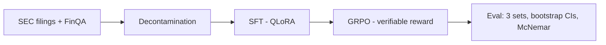

# OpenTune — Fine-Tuning & Evaluation Pipeline

> SFT (QLoRA) → GRPO (verifiable rewards) on an open-weight LLM, with statistically
> defensible improvement on a decontaminated financial QA benchmark, plus an
> un-confounded fine-tune-vs-prompting contrast experiment.

**Status:** Phase 0 **closed**. Qwen3-8B baseline matrix, frontier CoT
baseline (`anthropic/claude-haiku-4.5` via OpenRouter), and the cross-model
gate comparison are complete. Gate result: **FAIL** against the
pre-registered ≥8pt / non-overlapping-CI bar (see §1/§5) — but the gap is
real (McNemar p<0.0001) and modest (+5.32pts on finqa_test). **Decision:
proceed to Phase 1 (SFT/GRPO) with a revised target** — close most of the
measured gap to near-frontier prompting, rather than the original
"beat-frontier-by-8pts" framing.

**Phase 1 status (2026-09-23):** success criterion pre-registered
(`docs/phase1_gate.md` — SFT must reach ≥69.07% on finqa_test, i.e. ≥+3.5pts
over the 65.57% Qwen3-8B CoT baseline, with non-overlapping bootstrap 95%
CIs, closing ≥60% of the measured 5.32pt gap to frontier CoT) **before any
SFT training code or checkpoint existed.** Since then: the SFT training-data
pipeline is built (5,633 rows kept, 100% program-integrity rate), a QLoRA
run has completed on the full train set, and the resulting adapter is
published to HF Hub at
[`iashu2k/opentune-qwen3-8b-sft`](https://huggingface.co/iashu2k/opentune-qwen3-8b-sft).
**Next: evaluate this checkpoint against the frozen finqa_test/custom_eval/
sec_2026 sets to check the pre-registered gate** — no accuracy numbers exist
yet, only training loss (see §6).

Runs are tracked live in two W&B projects — kept separate so new Phase 1
tags never get mixed into the frozen Phase 0 table:
[`opentune-phase0`](https://wandb.ai/iashu2k-iashu2k/opentune-phase0/table?nw=nwuseriashu2k)
(frozen — baseline matrix, frontier CoT, gate comparison) and
`opentune-phase1` (live — SFT/QLoRA runs onward; filter by `arm`/`eval_set`/
`model` tags to find any specific cell referenced below or in future
checkpoints).

---

## 1. TL;DR Results

All numbers carry bootstrap 95% CIs (10,000 resamples, seed=0); each cell
links to the result artifact that produced it, and every run is also logged
in the [W&B project runs table](https://wandb.ai/iashu2k-iashu2k/opentune-phase0/table?nw=nwuseriashu2k).
No number appears here that isn't linked to an artifact. Frontier row is
paired to Qwen on shared ids; n reflects the paired set exactly (all three
sets paired at full n, no dropped ids).

| Model / method | FinQA test (n=1,127) | Custom eval (n=450) | SEC 2026 eval (n=180) |
|---|---|---|---|
| Qwen3-8B (zero-shot) | 47.47% [44.54, 50.40] | 45.33% [40.88, 50.00] | 58.33% [51.11, 65.56] |
| Qwen3-8B (best-effort prompting = CoT)¹ | 65.57% [62.82, 68.32] | 62.89% [58.44, 67.33] | 73.33% [66.67, 79.44] |
| **Frontier (`anthropic/claude-haiku-4.5`, CoT)²** | **70.90% [68.23, 73.56]** | **68.89% [64.67, 73.12]** | **66.11% [59.44, 72.78]** |
| SFT (QLoRA) — Phase 1 (target: ≥69.07%, see `docs/phase1_gate.md`)³ | — | — | — |
| GRPO (verifiable reward) — Phase 2 | — | — | — |

¹ CoT, not few-shot, is the locked best-effort-prompting arm: it beat
zero-shot on all three sets (exact McNemar p<0.0001 custom eval, p<0.0001
FinQA test, p=0.0006 SEC 2026). Few-shot was not significantly different from
CoT on custom eval (p=0.2589) and its FinQA-test cell was never run. Base
runs (Qwen3-8B, all arms) were logged to W&B with config
`{decode: greedy, max_new_tokens: 640, quantization: nf4-4bit}` per run.

² Frontier vs. Qwen CoT, paired exact McNemar (`scripts/compare_frontier.py`,
full report in `docs/gate_decision.md`, appended into `docs/baselines.md`):

| Eval set | Delta (pts) | CIs non-overlapping | McNemar b/c | McNemar p |
|---|---:|---|---|---:|
| finqa_test (**gate set**) | +5.32 | no | 134/74 | <0.0001 |
| custom_eval | +6.00 | no | 52/25 | 0.0028 |
| sec_2026 | −7.22 | no | 19/32 | 0.0919 |

**Gate result: FAIL.** Frontier beats Qwen CoT on FinQA test by a real,
statistically significant margin (p<0.0001) — but +5.32 points falls short of
the pre-registered ≥8-point bar, and the CIs overlap. Frontier also
underperforms Qwen CoT on SEC 2026 (not significant, n=180). **Decision
(2026-09-16): proceed to Phase 1 anyway, with the target reframed as "close
most of the +5.32pt gap to near-frontier CoT prompting"** rather than the
original "beat frontier by 8pts" framing — see §5 for the full rationale.
Caveat carried forward: the pinned frontier snapshot is Anthropic's
near-frontier tier (Claude Haiku 4.5), not flagship — this target is
calibrated to the model actually measured, not to an untested flagship
ceiling.

³ **SFT training is complete but not yet evaluated on any frozen eval set.**
1 epoch, 5,338 train rows (after length filtering), single-GPU QLoRA:
final `train_loss` 0.1054 (last logged step 0.0523), `eval_loss` 0.0498 on
the held-out 5% monitoring slice (`data/processed/sft_val_v1.jsonl` — **not**
one of the three frozen gate sets). Low loss here confirms the model learned
the deterministic output-format template, **not** that it answers FinQA
questions correctly — that requires running it through the frozen eval
harness, which is the next step. Adapter published to
[`iashu2k/opentune-qwen3-8b-sft`](https://huggingface.co/iashu2k/opentune-qwen3-8b-sft).

Raw predictions: `results/raw/Qwen3-8B__*.jsonl`,
`results/raw/anthropic--claude-haiku-4-5__*.jsonl`. All results with
bootstrap CIs: `docs/baselines.md` (base matrix + frontier/gate section
appended by `scripts/compare_frontier.py --append-to docs/baselines.md` —
confirmed run). Standalone gate report: `docs/gate_decision.md`. Total
frontier API spend: **$3.9994**. Phase 1 GPU spend to date: **$0**
(Kaggle free-tier T4, ~5.67 GPU-hours consumed by the SFT run).

## 2. Pipeline Diagram

<!-- Mermaid or image; update at each phase checkpoint -->



## 3. Quickstart / Reproduce

<!-- One command that recomputes the headline number; pinned deps -->

```bash
uv sync
uv run pytest -q            # 45 tests: extractor + prompt contract + exemplar consistency
# Rebuild the data core:
uv run python scripts/build_dataset.py      # FinQA parquets + gold policy
uv run python -m opentune.decontaminate     # decontaminated train + report
uv run python scripts/build_custom_eval.py  # custom eval (seed 42)
uv run python scripts/build_sec_eval.py     # SEC time-split eval (hits live EDGAR API)
# Base baselines (Kaggle T4, single-GPU pinned):
uv run python scripts/run_baselines.py --arm cot --eval-set finqa_test
uv run python scripts/aggregate_results.py  # bootstrap CIs + McNemar -> docs/baselines.md
# Frontier baseline via OpenRouter:
cp .env.example .env            # then fill in OPENROUTER_API_KEY; .env is gitignored
uv run python scripts/run_frontier.py --estimate --eval-set all   # zero-cost cost check first
uv run python scripts/run_frontier.py --eval-set all
# Cross-model gate comparison (frontier vs. Qwen CoT, paired McNemar):
uv run python scripts/compare_frontier.py --append-to docs/baselines.md

# --- Phase 1: SFT (run dataset build on Mac, training on Kaggle T4) ---
uv run python scripts/build_sft_dataset.py   # -> data/processed/sft_train_v1.jsonl (5,351) / sft_val_v1.jsonl (282)
# On Kaggle (GPU T4 x2 notebook, single-GPU pinned by default):
#   !git clone https://github.com/iashu2k/opentune && cd opentune
#   !pip install --upgrade --force-reinstall --no-cache-dir unsloth unsloth_zoo
#   !pip install trl peft transformers bitsandbytes accelerate wandb
#   (authenticate HF + W&B via Kaggle secrets, then:)
#   !python scripts/train_sft.py --epochs 1 \
#       --hub-repo-id iashu2k/opentune-qwen3-8b-sft --wandb-project opentune-phase1
```

## 4. Dataset

- **Source:** FinQA canonical release (`github.com/czyssrs/FinQA` JSONs, sha256
  logged in dataset card) — license **CC-BY-4.0**
- **Core training set:** 5,828 decontaminated examples
  (6,251 raw → 124 non-numeric golds dropped → 6,127 → 299 contamination-dropped)
- **Phase 1 SFT training set (v1, built 2026-09-22):** 5,633 of the 5,828
  decontaminated rows kept (96.65%) after excluding 195 rows using
  `table_average`/`table_max`/`table_min`/`table_sum` ops (these reference
  table row **labels**, not literal numbers, and resolving them requires
  parsing the linearized table in `context` — out of scope for v1, logged
  for a possible v2 pass). Every kept row's `program` string was
  **re-executed and verified to match its stored gold** within the frozen
  extractor's tolerance rule — 0 parse errors, 0 gold mismatches across all
  5,633 rows (100% program-integrity rate). A deterministic 95/5 split
  (seed 42) produced `data/processed/sft_train_v1.jsonl` (5,351 rows) and
  `data/processed/sft_val_v1.jsonl` (282 rows, held out purely for SFT
  loss-curve monitoring — **not** a substitute for the three frozen gate
  eval sets below). See `docs/phase1_gate.md` and `scripts/build_sft_dataset.py`
  for full methodology.
- **Deferred to a later iteration:** synthetic SEC-filing example mixing
  (originally targeted 6–8k total training rows with ≤30–40% synthetic) —
  v1 trains on the 5,633 real FinQA rows only, per the "simplest thing that
  could work" cost-discipline default.
- **Eval sets (all frozen):**
  1. **FinQA test** — 1,127 rows. Zero-shot, CoT, and frontier CoT are run;
     few-shot on this set has **not** been run.
  2. **Custom eval** — n=450, stratified sample of FinQA dev across
     (primary operator × context-length quartile), seed 42; composition
     matches dev within ~0.2 pts per operator band; median context 4,029 vs
     4,028 chars. Decontaminated vs train by construction (dev was in the
     decontamination corpus). All Qwen arms plus frontier CoT are run here.
  3. **SEC 2026 time-split eval** — n=180 across 37 companies, filings
     2026-01-09 to 2026-09-02. Golds **computed from XBRL company facts**
     (EDGAR API), never LLM-generated. All facts are filed after Qwen3-8B's
     release (2025-04-29), which makes this a **conservative post-release
     time-split / contamination-resistant check** — not a proof of
     corpus absence, since neither model's exact pretraining cutoff is
     officially disclosed. Frontier CoT actually scored *below* Qwen CoT
     here (66.11% vs. 73.33%, not significant at n=180) — a useful reminder
     that this set's condensed XBRL-table surface and narrow question
     templates don't necessarily favor whichever model wins on FinQA prose.
- **Gold-selection bookkeeping:** primary `exe_ans` covers 100% of kept FinQA
  rows; the `answer`-string fallback never fired on this revision

### Gold-selection policy (locked 2026-09-13, extractor v1.1)

All scoring uses `src/opentune/extract.py` (task-spec v1.1, 40-unit-test suite).

1. Primary gold: `exe_ans` (raw numeric)
2. Fallback: `answer` string if `exe_ans` fails extraction
3. Example dropped if neither field parses — applied identically to every
   model and arm

| Split | Raw | Non-numeric dropped | Kept | Exclusion rate |
|---|---|---|---|---|
| train | 6,251 | 124 | 6,127 | → decontamination below |
| dev | 883 | 10 | 873 | 1.13% |
| test | 1,147 | 20 | 1,127 | 1.74% |

### Extractor design note (`src/opentune/extract.py`, task-spec v1.1)

Every model output — base and frontier alike — is scored through the exact
same rule-based extractor, never an LLM judge, because every gold answer is
either directly numeric or programmatically computed:

**Output contract every arm must satisfy** (enforced by the prompt templates
in `src/opentune/prompts/templates.py`, and checked, not assumed, by the
extractor):

```text
<free-form reasoning>
Program: op(arg, arg), op(arg, arg), ...
ANSWER: <number>
```

**Answer-line matching rules:**

- Matching is line-based, case-insensitive, with a word boundary after
  "answer" — `Answers:` (plural) is deliberately **not** accepted.
- If a completion contains more than one `ANSWER:` line (self-correction),
  the **last non-empty one wins** — first-line-wins would penalize a model
  for catching its own mistake mid-generation.
- No answer line found → `Status.NO_ANSWER` (scored false, never a crash).
- An answer line exists but doesn't parse as a number → `Status.NON_NUMERIC`
  (scored false, never a crash). This status is a first-class signal, not
  swallowed: extraction-failure rates are reported per arm in this README's
  Failure Modes section rather than silently dropped from denominators.

**Canonicalization (applied identically to gold and prediction, so scoring
is symmetric):**

- Strip currency symbols, thousands-commas, backticks, and quotes.
- Accounting-style parentheses mean negative, e.g. `(11)` → `-11`.
- `%` or the word "percent" means divide by 100 — canonical form is a
  fraction of 1, so a bare `37.5` against a gold of `0.375` is scored as a
  **miss**, not a near-match; this asymmetry is intentional and documented,
  not a bug.
- Unicode minus/dash variants normalize to ASCII `-`.
- Literal `\n`/`\t` escape-sequence artifacts in golds are accepted rather
  than treated as parse failures.
- Scientific notation (`1e-05`) is accepted.
- Misplaced/duplicated commas (`1,2,3` → `123`) are repaired before parsing.
- Unit-bearing semantic strings (`$ 108 million`) are **rejected**, not
  guessed — the extractor never infers scale (thousands/millions/etc.) from
  context, because that inference is exactly the kind of silent assumption
  that would make scoring unauditable. Rows requiring this are excluded at
  dataset-build time instead (see exclusion counts above).

**Numeric match tolerance** — `Decimal`-based, piecewise, not a single
relative or absolute rule:

```text
correct iff |pred - gold| <= tol
tol = 0.001 * |gold|   if |gold| >= 1000
      0.01              otherwise
```

This replaced an earlier `max(0.01, 0.001*|gold|)` formulation that let the
relative term dominate starting at `|gold| >= 10` — a boundary-value unit
test caught this before any baseline was ever run, and the fix is logged in
the Experiment Log (§6, 2026-09-13, "Extractor v1").

**Test coverage:** 40 extractor/scoring unit tests plus 5 prompt-contract
tests (45 total), covering the canonicalization edge cases above, the
piecewise-tolerance boundary, and multi-line self-correction — run via
`uv run pytest -q` before any baseline or frontier execution, and referenced
as a pre-flight check in every runbook step in this document.

### Smoke validation

Full dev split, 1,766 gold values: 97.7% parse coverage; every failure
accounted for as non-numeric/empty gold. LaTeX-escape artifacts (`4.9\n`) and
scientific-notation golds (`1e-05`) handled by extractor v1.1. Text artifacts
cleaned model-side by `build_dataset.py`; golds cleaned scorer-side only.

### Decontamination (locked 2026-09-13)

- 8-gram word-level containment; eval-side corpus = dev + test question and
  context shingles (377,298 distinct 8-grams)
- Drop rule: question-containment ≥ 0.5 vs. **any** eval-side shingle
- Result: 299 / 6,127 train examples dropped (4.9%) → 5,828 decontaminated
- Known aggressiveness: short template questions ("what is the growth rate in
  net revenue in 2008?") collide at q-containment 1.0 even across unrelated
  filings; the data loss is accepted over leakage risk (decisions log)
- Context-side containment measured, not dropped on (filing boilerplate):
  p50 = 0.043, p95 = 0.657 — disclosed for transparency
- Report: `data/processed/decontamination_report.json`
- Synthetic SEC training examples will pass the same gate before mixing

### SEC eval invariants (verified mechanically at build time)

1. Every gold self-scores through the extractor (0 unparseable)
2. Every program string **executes to its gold** (0 mismatches — catches
   sign-convention drift)
3. Every numeric figure in a program appears verbatim in its context

Percent-change convention: change relative to the **magnitude** of the base
period; programs encode |base| explicitly (see experiment log).

### Operator inventory (decontaminated train)

Core: divide 4,175 | subtract 2,540 | add 1,480 | multiply 550.
Table band: table_average 92 | table_max 48 | table_sum 34 | table_min 27.
Tail: exp 5; power/greater absent. Phase 2 format-reward grammar = this set.
**Note (Phase 1):** the table_* band (201 op-instances across 195 rows,
some rows use two table ops) is exactly what got excluded from the v1 SFT
set above — this inventory is unchanged, only which rows get trained on
in Phase 1 changed.

### Phase 1 SFT target format (locked 2026-09-22, `scripts/build_sft_dataset.py`)

SFT training targets follow the exact same frozen output contract as eval
(reasoning → `Program:` line → `ANSWER:` line), but the reasoning is
**synthesized deterministically from the `program` DSL**, never freely
generated — because no natural-language reasoning trace exists anywhere in
the source data, only the symbolic program and the final gold number.
Terse, mechanical templates ("Step 1: subtract 1.2 from 34.8 to get 33.6
(#0).") were chosen over more natural-sounding prose specifically to
guarantee the reasoning can never contradict the gold answer, since it's
derived from the same re-executed program that produces it.

**Program DSL notes discovered while building this (both confirmed by
re-execution against real rows, not guessed):**
- `#N` references the 0-indexed output of a prior step.
- `const_N` is a literal constant (e.g. `const_100`, `const_1000000`).
- `const_mN` is the **negative** constant family — `const_m1` = -1.0. Found
  in 16 rows; e.g. `multiply(3176, const_m1), divide(#0, 10379)` executes to
  -0.306, matching the stored gold exactly. The parser supports the general
  `const_m<N>` = -N form defensively, though only `const_m1` was observed.

## 5. Decisions Log

| Date | Decision | Choice | Rationale |
|---|---|---|---|
| 2026-09-13 | Base model (Phases 1–2) | **Qwen3-8B — verified:** Apache 2.0 (derived weights OK w/ notices), 32K native context | Strongest permissively-licensed 7–9B at kickoff |
| 2026-09-13 | Small model (Phase 3) | Qwen3-4B (same-family 3–4B) | Clean size ablation for the contrast experiment |
| 2026-09-13 | Domain / task | Financial QA (FinQA) | Ties into SEC-filings narrative |
| 2026-09-13 | FinQA source | Canonical GitHub JSONs, sha256-pinned | Hub copies ship legacy loader scripts / merge splits — unpinned, unsafe |
| 2026-09-13 | Prompting arm | Few-shot + CoT + format constraints; exemplars from **train only**, hand-verified | Half-hearted prompting is attackable; exemplar leakage silently inflates evals |
| 2026-09-13 | RL method | GRPO w/ verifiable rewards (not DPO) | FinQA has exact gold answers; verifiable-reward RL is best practice |
| 2026-09-13 | Training stack | Unsloth (QLoRA) + TRL `GRPOTrainer` | Single-GPU proven; fast SFT on free T4s |
| 2026-09-13 | Eval stack | Custom scorer, rule-based extraction (unit-tested) | Extraction bugs silently corrupt all numbers |
| 2026-09-13 | Scoring tolerance | Piecewise: 0.01 abs; 0.1% rel only for \|gold\| ≥ 1000 | Original `max()` formula let the relative arm dominate from \|gold\| ≥ 10 — caught by boundary tests pre-baseline |
| 2026-09-13 | Percent canonicalization | `x%` ≡ `x/100`; bare `37.5` vs gold `0.375` is a miss | FinQA golds mix both forms; symmetric rule, documented edge |
| 2026-09-13 | Multi-answer lines | Last non-empty ANSWER line wins | Models self-correct; first-line rule penalizes correction |
| 2026-09-13 | Statistics | Bootstrap CIs everywhere; McNemar for paired comparisons; 3 seeds for headlines | n=200 noise floor made ±8-pt gates unsupported |
| 2026-09-13 | Decontamination rule | Conservative corpus-level question containment; accept ~5% over-drop incl. benign template collisions | Simplicity + reviewer-defensibility over data recovery |
| 2026-09-13 | Time-split boundary | SEC filings filed ≥ 2026-01-01 | Post-Qwen3-release proxy; explicitly **not** a formal proof of zero contamination for either arm, since neither model's exact pretraining cutoff is disclosed |
| 2026-09-13 | SEC eval source | EDGAR XBRL companyfacts API; golds computed, not LLM-written | Exact verifiable golds, `filed` filter enforces cutoff mechanically; declared UA + ≤5 req/s pacing per SEC fair-access policy |
| 2026-09-13 | Tracking / hosting | W&B (free), HF Hub weights + model cards | Free, recruiter-visible |
| 2026-09-14 | GPU execution | Single T4 process (`CUDA_VISIBLE_DEVICES=0` set pre-import) | Unsloth's Qwen3 attention path put padded attention bias on cuda:0 while layers ran on cuda:1 under 2-GPU batching; single-GPU pin fixed it |
| 2026-09-16 | Best-effort-prompting arm | **CoT**, not few-shot | Significantly beats zero-shot on all 3 sets; not significantly different from few-shot on custom eval (p=0.2589), so no superiority claim there — CoT wins on "most sets with the most data" |
| 2026-09-16 | Frontier snapshot | `anthropic/claude-haiku-4.5` (Claude Haiku 4.5) via OpenRouter, provider pinned to `anthropic` | Near-frontier tier; flagship tiers priced at ~$10–19 for the workload, past the $3–6 target — actual spend came in at $4.00 |
| 2026-09-16 | Frontier decode config | `temperature=0`, no `reasoning` param set | Deterministic; prompted-CoT parity with Qwen's CoT arm |
| 2026-09-16 | Secret management | `OPENROUTER_API_KEY` in a local `.env` (gitignored), loaded via `python-dotenv` | Never commit API keys |
| 2026-09-16 | Phase 0 gate evaluated | **FAIL** — frontier CoT beats Qwen CoT by +5.32 pts on finqa_test (McNemar p<0.0001, real but modest), short of the pre-registered ≥8-pt / non-overlapping-CI bar; frontier underperforms on SEC 2026 (not significant) | Gate criterion was pre-registered before any results existed, specifically to prevent post-hoc goal-moving; result stands as measured against `anthropic/claude-haiku-4.5` |
| 2026-09-16 | **Phase 1 framing (resolved)** | **Proceed to SFT/GRPO with a revised, smaller target: close most of the +5.32pt (finqa_test) gap to near-frontier CoT prompting**, instead of (a) reframing around cost/latency, or (b) spending more to test a flagship-tier snapshot first | The measured gap is real (p<0.0001) and Qwen3-8B is already close enough that verifiable-reward RL/SFT is plausible to close most of it; a flagship-tier frontier ceiling remains untested and unclaimed — Phase 1 targets are set against the measured near-frontier gap, not an assumed larger one. Revisit and re-test against a flagship snapshot later if Phase 1 results warrant a stronger comparison |
| 2026-09-22 | Phase 1 tracking | New W&B project **`opentune-phase1`**, kept separate from `opentune-phase0` | Phase 0's project stays frozen/historical; new SFT/GRPO run tags never mix into the closed baseline table, avoiding any ambiguity about which runs back which published number |
| 2026-09-22 | **Phase 1 gate pre-registered** | SFT checkpoint must reach **≥69.07%** on finqa_test (≥+3.5pts over the 65.57% Qwen3-8B CoT baseline), **non-overlapping bootstrap 95% CIs**, i.e. closing **≥60%** of the measured 5.32pt gap to frontier CoT (70.90%). Full spec, methodology, and pre-committed decision branches (full pass / partial pass / fail) in `docs/phase1_gate.md` | Mirrors the Phase 0 discipline of locking a criterion before any results exist. 3.5pts is chosen deliberately below full gap closure — Phase 2 (GRPO) is expected to close the remainder, so Phase 1 isn't required to solve the whole gap alone |
| 2026-09-22 | SFT v1 scope | Exclude `table_average/max/min/sum` rows (195/5,828, ~3.3%) from the v1 SFT set; defer synthetic SEC-filing mixing entirely | These ops reference table row labels, not literal numbers — resolving them needs table-cell extraction from `context`, real scope not worth it for v1. Small, logged exclusion beats silently forcing incorrect reasoning traces |
| 2026-09-22 | SFT reasoning-trace synthesis | Terse, deterministic, program-derived templates ("Step 1: ... to get X (#0)."), not free-form generation | No natural-language rationale exists in the source data; template derivation guarantees the reasoning can never contradict the re-executed gold, at the cost of stylistic mismatch with real CoT prose (acceptable for v1, revisit if eval shows a format-compliance issue) |
| 2026-09-22 | SFT val split | 5% held out (seed 42) for training-loss monitoring only — 5,351 train / 282 val | Watches for overfitting during training without touching any of the three frozen gate eval sets |
| 2026-09-22 | Qwen3 thinking mode | `enable_thinking=False` for all SFT chat-template rendering | The task-spec's own reasoning→Program→ANSWER contract is the intended reasoning mechanism; Qwen3's native `<think>` tags would conflict with it |
| 2026-09-22 | Multi-GPU training test | Explicitly tested 2-GPU training (no pin) on Kaggle T4×2 before committing to single-GPU by default | Resolves the open question carried from the 2026-09-14 inference-time bug: does it also affect training? |
| 2026-09-22 | **GPU config for training: single-GPU** | Chose single-GPU over multi-GPU for the real run | Multi-GPU test did **not** crash (unlike the Phase 0 inference bug) but showed no speed benefit either (26.24 sec/it multi-GPU vs. 28.06 sec/it single-GPU — statistically equivalent, model comfortably fits one T4's VRAM). Single-GPU chosen for simplicity, not necessity |
| 2026-09-22 | SFT epochs (v1) | 1 epoch, not 2 | Dry-run pace (~28 sec/it) projected ~10.4 hours for 2 epochs — exceeds a single Kaggle session and a large fraction of the weekly 30 GPU-hr quota. 1 epoch (~5.7 hrs) chosen as the safer first attempt; checkpoints push to HF Hub, so a second epoch can be resumed later if eval results show underfitting |
| 2026-09-22 | HF Hub target | `iashu2k/opentune-qwen3-8b-sft` | Confirmed repo for all Phase 1 SFT adapter checkpoints |

## 6. Experiment Log

Negative results stay in. Every run: config, cost, result, verdict.

| Date | Run | Config | Cost | Result | Verdict |
|---|---|---|---|---|---|
| 2026-09-13 | Extractor v1 | task-spec v1 | $0 | `max()` tolerance formula let relative arm dominate at \|gold\| ≥ 10; caught by boundary test | Rolled back → piecewise rule |
| 2026-09-13 | Extractor v1.1 | + LaTeX-escape golds, scientific notation | $0 | 3 new format tests pass; 40-test suite green | Kept |
| 2026-09-13 | Gold smoke validation | Full FinQA dev, 1,766 golds | $0 | 97.7% per-field coverage; all failures = documented non-numeric tail | Kept; filter policy locked |
| 2026-09-13 | Dataset build v1 | FinQA canonical JSONs | $0 | Literal `\n`/`\t` artifacts leaking into model-facing text | Fixed in build v2 (clean_text); counts unchanged |
| 2026-09-13 | Decontamination run 1 | 8-gram containment @ 0.5, dev+test corpus | $0 | 299/6,127 dropped (4.9%) → 5,828; worst offenders = benign template collisions | Kept (conservative rule) |
| 2026-09-13 | Prompt templates | zero-shot / CoT / few-shot v1 | $0 | few-shot v1 committed with display-elided contexts; caught at render check; regenerated verbatim from parquet | Fixed; render verified |
| 2026-09-13 | Custom eval build | stratified (operator × ctx quartile), seed 42 | $0 | n=450; composition drift ≤0.2 pts/band; median ctx 4,029 ≈ dev 4,028 | Kept |
| 2026-09-13 | SEC eval v1 | EDGAR XBRL, 60-company sample | $0 | magnitude-base sign mismatch (program ‖ gold on negative-base rows) found by eyeball sample; first-pass validator also misparsed multi-arg ops | Both fixed; all 3 invariants verified |
| 2026-09-13 | SEC eval v2 | n=180, 37 companies, filed 2026-01-09..09-02 | $0 | 0 unparseable golds; 0 program-gold mismatches; 0 figures absent from context | Kept |
| 2026-09-14 | Base runner v1 dry run | Serial decode, `max_new_tokens=640` | $0 (compute) | Zero-shot rambled after answer → 52.6 sec/example, projected ~77 GPU-hours for full matrix | Replaced by stop-string boundaries + batching |
| 2026-09-14 | Base runner v2, T4×2 | Padded batched generation | $0 | Unsloth Qwen3 attention-mask cuda:0/cuda:1 device mismatch, crashed | Pinned to single GPU (`CUDA_VISIBLE_DEVICES=0`) |
| 2026-09-14 | Few-shot batch sizing | Single T4, batch 8 | $0 | CUDA OOM from ~3k-token exemplar overhead + KV cache | Batch size 4; kept |
| 2026-09-14–16 | Qwen3-8B baseline matrix | Greedy NF4, resumable JSONL, 3 arms × up to 3 eval sets | $0 (free-tier GPU) | All expected cells present at exact row counts except few-shot/finqa_test (deferred); see `docs/baselines.md` and [W&B runs table](https://wandb.ai/iashu2k-iashu2k/opentune-phase0/table?nw=nwuseriashu2k) | Kept |
| 2026-09-16 | Aggregation | Bootstrap 95% CI (10k resamples) + exact McNemar | $0 | CoT beats zero-shot everywhere (p<0.0001 to p=0.0006); CoT vs. few-shot not significant on custom eval (p=0.2589); few-shot vs. zero-shot not significant on SEC (p=0.1052) | CoT locked as best-effort-prompting arm; **base baselines published** to `docs/baselines.md` |
| 2026-09-16 | Frontier snapshot pricing | Priced Anthropic/OpenAI/Google current tiers against the 1,757-call CoT workload | $0 | Flagship tiers project $10–19; Claude Haiku 4.5 projects ~$5–8 | Pinned `anthropic/claude-haiku-4.5` via OpenRouter |
| 2026-09-16 | `run_frontier.py` build + fixes | Resumable, retrying, cost-logging runner; fixed to match real `render_prompt(name, question, context)` and `score(output, gold)` signatures after first pass errored | $0 | `--estimate` projected $8.28 worst case | Ready to execute |
| 2026-09-16 | Frontier CoT run — sec_2026 | n=180, max_tokens=700, temp=0 | $0.2907 | 66.11% acc; 180/180 `status=ok`, 180/180 `finish_reason=stop` | Clean run, below Qwen CoT (73.33%) on this set |
| 2026-09-16 | Frontier CoT run — custom_eval | n=450, same config | $1.0547 (cumulative $1.3454) | 68.89% acc | Clean run |
| 2026-09-16 | Frontier CoT run — finqa_test | n=1,127, same config | $2.6540 (cumulative $3.9994) | 70.90% acc | Clean run; total frontier spend $4.00, within $3–6 target |
| 2026-09-16 | Cross-model gate comparison | `scripts/compare_frontier.py --append-to docs/baselines.md`, paired bootstrap CI + exact McNemar, frontier vs. Qwen CoT, all 3 sets | $0 | finqa_test: +5.32pts, p<0.0001, CIs overlap. custom_eval: +6.00pts, p=0.0028, CIs overlap. sec_2026: −7.22pts, p=0.0919, CIs overlap | **Gate: FAIL**; **all baselines (base + frontier) published** to `docs/baselines.md` and `docs/gate_decision.md` |
| 2026-09-16 | Phase 1 framing decision | Reviewed FAIL result and 3 options | $0 | Chose to proceed to SFT/GRPO with revised target (close most of the +5.32pt gap) over reframing to cost/latency or re-testing a flagship snapshot | Phase 0 closed; Phase 1 scoped |
| 2026-09-22 | Phase 1 gate pre-registration | Target set before any SFT code/run exists: ≥69.07% finqa_test, non-overlapping CIs vs. 65.57% baseline | $0 | Full spec committed to `docs/phase1_gate.md`; decision branches (full/partial/fail pass) pre-committed | Kept — this is the gate SFT results will be judged against |
| 2026-09-22 | SFT dataset build v1 | Excludes table_* ops; program re-execution gate; `scripts/build_sft_dataset.py` | $0 | 5,828 input → 195 excluded (table ops) → 5,633 kept; 0 parse errors, 0 gold mismatches (100% program-integrity rate) | Kept — `data/processed/sft_train_v1.jsonl` |
| 2026-09-22 | `const_m1` DSL discovery | Investigated a `ValueError` crash on an unrecognized program token | $0 | `const_m1` = -1.0 constant, confirmed by re-executing 16 affected rows against stored gold (100% match); parser generalized to `const_m<N>` = -N | Fixed; script hardened to log-and-skip any future unrecognized token instead of crashing |
| 2026-09-22 | Val split carve-out | 5%/seed 42 deterministic split of the 5,633 kept rows | $0 | 5,351 train / 282 val, for training-loss monitoring only | Kept — does not touch any frozen gate eval set |
| 2026-09-22 | Sequence-length check | Char-based token estimate on real dataset | $0 | p95≈1,955 tokens, p99≈2,639, max≈4,616 (est.) | `max_seq_length=3072` chosen; real tokenizer filtering deferred to the training script itself |
| 2026-09-22 | Multi-GPU training test | Kaggle T4×2, no GPU pin, 100-sample/1-epoch dry run | $0 | No crash (unlike Phase 0's inference-time bug); 26.24 sec/it, `Data Parallel GPUs=1` (model-sharded, not data-parallel) | Informative — resolves the open bug-scope question; not adopted for the real run |
| 2026-09-22 | Single-GPU training test | Same dry run, `CUDA_VISIBLE_DEVICES=0` | $0 | 28.06 sec/it — statistically equivalent to the multi-GPU test | Single-GPU adopted for the real run (simplicity, not a forced fix) |
| 2026-09-22 | HF Hub auth fix | First real-run attempt hit `401 Unauthorized` on `push_to_hub` | $0 | Kaggle session wasn't authenticated to HF; fixed via `huggingface_hub.login()` using a Kaggle secret before the training script runs | Fixed; documented as a required pre-run cell |
| 2026-09-22 | W&B auth fix | Second real-run attempt hung on an interactive `wandb: Enter your choice:` prompt | $0 | Non-interactive Kaggle cells can't answer stdin prompts; fixed via `wandb.login(key=...)` using a Kaggle secret before the script runs | Fixed; documented as a required pre-run cell |
| 2026-09-22–23 | **SFT v1 training run** | Qwen3-8B QLoRA (r=16, α=16, all attn+MLP proj targets), 1 epoch, 5,338/5,351 train rows kept after length filter (13 dropped, max_seq_length=3072), single-GPU pin, `enable_thinking=False`, completion-only loss masking | $0 (Kaggle free-tier T4, ~5.67 GPU-hrs) | 668/668 steps completed; final `train_loss`=0.1054 (last step 0.0523), `eval_loss`=0.0498 on the 279-row (3 dropped) val slice; `train_runtime`=20,401s (~5.67h) | Kept — adapter pushed to [`iashu2k/opentune-qwen3-8b-sft`](https://huggingface.co/iashu2k/opentune-qwen3-8b-sft). Low loss confirms format learned, **not** FinQA accuracy — gate evaluation is the next step, not yet run |
| 2026-09-22–23 | Kaggle session disconnect | Console output lost near run completion during the real training run | $0 | Training had already finished and the HF push had already succeeded before the disconnect — only the console *display* of the final metrics was lost, not the artifact. Recovered final metrics from the W&B run summary instead | Documented as an operational lesson: **W&B is the authoritative source for training metrics going forward, not console logs** |

## 7. Failure Modes / Known Limitations

- Unit-burdened FinQA golds (e.g. `$ 108 million`) excluded rather than guessed —
  the intended scale is context-dependent
- ~1–2% of FinQA per split unscorable by design (yes/no tail, empty
  annotations, rare annotation garbage) — exclusion counts in §4
- Decontamination over-drops short template questions (~5% of train) — a
  deliberate trade
- FinQA itself may occur in base-model pretraining corpora — why the SEC 2026
  set exists (contamination-side check)
- SEC eval contexts are **condensed XBRL fact tables**, not raw filing prose —
  tests post-cutoff reasoning over real SEC data, not raw-document reading
- SEC eval question diversity is two shapes (QoQ percent-change, cash/asset
  portion); it is a contamination check, not a general-capability benchmark;
  it's also the one set where frontier CoT underperformed Qwen CoT, so it's
  not a simple "frontier just wins" story
- EDGAR universe sampled randomly: SPACs/ADRs yield nothing (+0); 23 of 60
  sampled companies contributed no facts
- **The SEC 2026 time split is a proxy, not proof:** neither model's exact
  pretraining cutoff is officially disclosed
- Few-shot on FinQA test has not been run; the base prompt ablation is not a
  complete 3×3 matrix yet
- Output-extraction compliance is imperfect and arm-dependent for the base
  model (zero-shot as low as 80.6% OK); frontier extraction was clean
  (180/180 `status=ok` observed on sec_2026, no truncated completions)
- **The pinned frontier snapshot (Claude Haiku 4.5) is near-frontier, not
  flagship, tier.** The Phase 1 target ("close most of the +5.32pt gap") is
  calibrated to this model, not to an untested flagship ceiling — if a
  flagship model would show a larger gap, that would only be discovered by
  actually testing one later
- The pre-registered gate itself is a conservative, somewhat blunt
  instrument: "non-overlapping CIs" conflates statistical significance with
  effect size. The finqa_test result is statistically significant
  (McNemar p<0.0001) but fails the gate anyway because the CI-overlap
  criterion and the 8-point threshold are both stricter than a plain
  significance test — this is why the team chose to proceed to Phase 1
  despite the formal FAIL, rather than treating FAIL as an automatic stop
- The W&B project link above is a runs-table view, not per-cell deep links;
  a reviewer needs to filter by `arm`/`eval_set`/`model` tags to find a
  specific baseline run rather than clicking a single per-number link
- **Phase 1 SFT training set excludes ~3.3% of decontaminated train**
  (table_average/max/min/sum rows) and defers synthetic SEC-filing mixing
  entirely — v1 trains on 5,633 real FinQA rows only, smaller than the
  original 6-8k target. Revisit both if v1 eval results fall short of the
  pre-registered gate.
- **SFT reasoning traces are template-synthesized, not natural CoT prose** —
  terse and mechanical ("Step 1: subtract X from Y..."), chosen to
  guarantee correctness over stylistic naturalness. If eval shows the model
  produces oddly robotic reasoning as a side effect, this is the likely
  cause, and a v2 pass with more natural templating is the fix.
- **Low SFT training/eval loss (0.05, 0.05) reflects format-learning on a
  low-entropy synthetic target, not FinQA accuracy** — this number cannot
  be compared to the frontier/base accuracy percentages in §1 and should
  not be reported as a headline result. The pre-registered gate in
  `docs/phase1_gate.md` is the only number that determines Phase 1 success.
- Multi-GPU training on Kaggle T4×2 uses Unsloth's naive model-sharding
  (`Data Parallel GPUs=1`), not true data-parallel training — it neither
  crashed nor sped anything up in the one test run made; single-GPU was
  chosen for simplicity, not because multi-GPU was proven unsafe here
  (unlike the inference-time bug in Phase 0, which was a proven crash).

## 8. Artifacts Index

- Extractor + scoring: `src/opentune/extract.py` (task-spec v1.1) — 40 tests;
  design note in §4 above
- Prompt templates + verified exemplars: `src/opentune/prompts/` — 5 contract tests
- Decontamination: `src/opentune/decontaminate.py`
- Task spec: `docs/task-spec.md`
- Phase 1 gate: `docs/phase1_gate.md` (pre-registered 2026-09-22, before any SFT run)
- Data: `data/processed/finqa_{train,dev,test}.parquet`,
  `finqa_train_decontaminated.parquet`, `decontamination_report.json`
- Eval sets: `data/eval/custom_eval.parquet` (n=450, seed 42),
  `data/eval/sec_2026_eval.parquet` + `sec_2026_report.json` (n=180)
- **Phase 1 SFT dataset:** `scripts/build_sft_dataset.py`,
  `data/processed/sft_train_v1.jsonl` (5,351), `data/processed/sft_val_v1.jsonl`
  (282, monitoring-only), `data/processed/sft_train_v1_report.json`
  (exclusion/parse-error/mismatch counts)
- **Phase 1 SFT training:** `scripts/train_sft.py` (Unsloth QLoRA + TRL
  `SFTTrainer`, single-GPU, `enable_thinking=False`, completion-only loss
  masking), `outputs/sft_v1/length_filter_report.json`
- Base baselines: `scripts/run_baselines.py`, `scripts/aggregate_results.py`,
  `results/raw/Qwen3-8B__*.jsonl`, `results/aggregates.json`, `docs/baselines.md`
- Frontier baseline: `scripts/run_frontier.py` (OpenRouter,
  `anthropic/claude-haiku-4.5`, provider `anthropic`),
  `.env.example` (copy to `.env`, gitignored),
  `results/raw/anthropic--claude-haiku-4-5__cot__*.jsonl`,
  `results/raw/manifest_frontier__anthropic--claude-haiku-4-5.json`
- Cross-model gate comparison: `scripts/compare_frontier.py`,
  `docs/gate_decision.md` (standalone), plus appended section in
  `docs/baselines.md` (all results with bootstrap CIs now live in one file)
- Run tracking: [W&B project `opentune-phase0`](https://wandb.ai/iashu2k-iashu2k/opentune-phase0/table?nw=nwuseriashu2k)
  (frozen), `opentune-phase1` (live — Phase 1 onward)
- **Weights + model cards:** SFT v1 adapter —
  [`iashu2k/opentune-qwen3-8b-sft`](https://huggingface.co/iashu2k/opentune-qwen3-8b-sft)
  on HF Hub (pushed 2026-09-23)
- Reward function: `src/opentune/` (Phase 2)
- Demo: — (pre-recorded video, Phase 4)

## 9. License & Citation

FinQA: CC-BY-4.0 (cite FinQA paper — Chen et al., EMNLP 2021).
Qwen3-8B: Apache 2.0 (derived-weight redistribution permitted with notices).
Claude Haiku 4.5: Anthropic proprietary model, accessed via OpenRouter's API
under OpenRouter's and Anthropic's respective terms — outputs used for
evaluation only, no weights redistributed.
SEC EDGAR companyfacts: public domain government data, accessed per fair-access
policy (declared UA, ≤5 req/s).
TODO — code license, synthetic-data provenance. Finalized before Phase 4.

## 10. Changelog

| Date | Phase | Change |
|---|---|---|
| 2026-09-13 | 0 | Repo initialized. |
| 2026-09-13 | 0 | Extractor v1.1 + task-spec v1 locked (40 tests); tolerance-formula fix logged. |
| 2026-09-13 | 0 | Data core locked: FinQA parquets (gold policy), decontaminated train (5,828), contamination report published. |
| 2026-09-13 | 0 | Prompt templates + hand-verified exemplars locked (45 tests); operator inventory recorded. |
| 2026-09-13 | 0 | Custom eval frozen (n=450, stratified, seed 42). |
| 2026-09-13 | 0 | SEC 2026 time-split eval built (n=180, 37 co.): XBRL-computed golds, post-release time split (framed as a proxy, not proof), 3 mechanical invariants. Base model verified (Qwen3-8B, Apache 2.0). |
| 2026-09-16 | 0 | Qwen3-8B baseline matrix run and aggregated (bootstrap CIs + exact McNemar); CoT locked as best-effort-prompting arm. **Baselines published** to `docs/baselines.md`, with runs logged to the [W&B project](https://wandb.ai/iashu2k-iashu2k/opentune-phase0/table?nw=nwuseriashu2k). |
| 2026-09-16 | 0 | Frontier snapshot pinned (`anthropic/claude-haiku-4.5` via OpenRouter, provider pinned to `anthropic`); `scripts/run_frontier.py` implemented, `OPENROUTER_API_KEY` read from gitignored `.env`. |
| 2026-09-16 | 0 | Frontier CoT run executed on all 3 eval sets (sec_2026, custom_eval, finqa_test); total spend $3.9994. |
| 2026-09-16 | 0 | Cross-model gate comparison run and appended to `docs/baselines.md`: Phase 0 gate result = FAIL — finqa_test delta +5.32pts (p<0.0001, CIs overlap), below the pre-registered ≥8pt bar. |
| 2026-09-16 | 0→1 | **Phase 0 closed.** Decision: proceed to Phase 1 (SFT/GRPO) with revised target — close most of the +5.32pt gap to near-frontier CoT prompting, rather than beat it by 8pts or reframe to cost/latency. |
| 2026-09-22 | 1 | **Phase 1 gate pre-registered** (`docs/phase1_gate.md`) before any SFT training code or checkpoint exists: SFT must reach ≥69.07% on finqa_test (≥+3.5pts vs. Qwen3-8B CoT), non-overlapping bootstrap 95% CIs, closing ≥60% of the 5.32pt gap to frontier CoT. New W&B project `opentune-phase1` created for Phase 1 tracking, kept separate from the frozen `opentune-phase0` table. |
| 2026-09-22 | 1 | **SFT dataset built:** `scripts/build_sft_dataset.py` excludes table_* op rows (195/5,828) and re-executes every remaining program against its gold (0 parse errors, 0 mismatches on 5,633 rows). `const_m1`-family DSL constant discovered and handled. Deterministic 95/5 val split (seed 42) → `sft_train_v1.jsonl` (5,351) / `sft_val_v1.jsonl` (282, monitoring-only). |
| 2026-09-22–23 | 1 | **SFT v1 training run completed** on Kaggle T4 (single-GPU, tested multi-GPU explicitly first — no crash, no speed benefit either): Qwen3-8B QLoRA, 1 epoch, 668 steps, `train_loss`=0.1054 (final step 0.0523), `eval_loss`=0.0498. Adapter pushed to [`iashu2k/opentune-qwen3-8b-sft`](https://huggingface.co/iashu2k/opentune-qwen3-8b-sft). **No accuracy numbers exist yet** — next step is evaluating this checkpoint against the frozen finqa_test/custom_eval/sec_2026 sets to check the pre-registered gate. |

---

### Hardware / workflow note

Development on M2 Air 8GB (scripting, data curation, ≤1B dry-runs only). All 7–9B
training and evaluation runs on Kaggle / Colab free tier; RunPod A100 (~$1–1.50/hr)
as paid fallback. Budget target: ≤ $30 total. Budget spent to date: **$3.9994**
(frontier baseline via OpenRouter; base baselines and the Phase 1 SFT run both
used free-tier GPU at $0 API cost — the SFT run consumed ~5.67 of the weekly
30 Kaggle GPU-hour quota).
